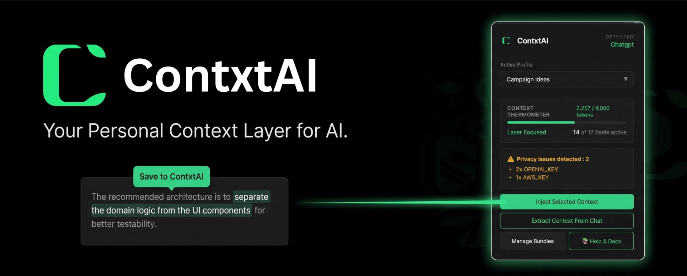
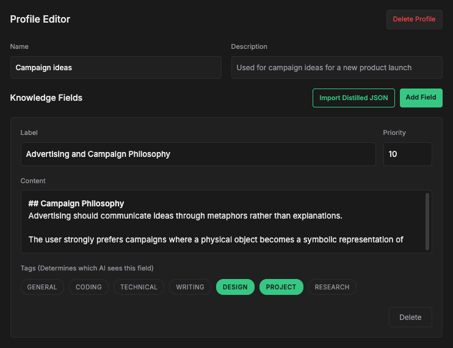
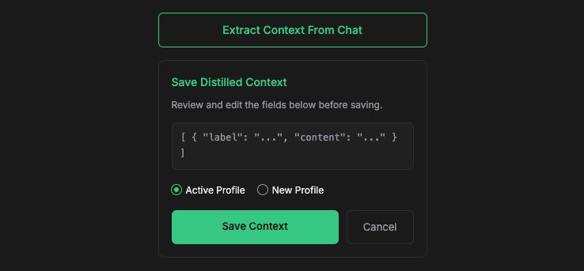
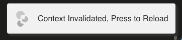

<div align="center">
  

  <br/>
  
  [](LICENSE)
  [](package.json)
  []()
</div>

<h1 align="center"><a href="https://contxtai.vinaykolupula.workers.dev/">ContxtAI</a></h1>

<div align="center">
  <a href="https://chromewebstore.google.com/detail/contxtai/dmhnnfkppbobolkngkblakklfhigbidh">
    
  </a>
</div>

<h2 align="center">Your Privacy-First Browser Extension for AI Context Management.</h2>

<br/>
ContxtAI is a lightweight, privacy-focused browser extension that gives you ownership of your AI context.

Create reusable context profiles containing your projects, preferences, writing styles, goals, and workflows, then inject them into any supported AI platform with a single click.

No more re-explaining your writing styles, project history, or conversation context every time you switch models.


### The Problem :


Every AI conversation starts from zero.


Users repeatedly explain:

- Who they are and what they do
- What projects they are working on
- Their technology stack and architecture decisions
- Their coding standards and preferences
- Their writing style and audience
- Their business goals and constraints
- Their design preferences and tooling


This creates several problems:

- Repeated context setup wastes time and tokens
- Responses become inconsistent across AI platforms
- Valuable project knowledge becomes trapped inside individual AI providers
- Switching between AI tools means losing accumulated context
- Users have little visibility into what each AI actually knows about them

---

## The Solution



<br/>

ContxtAI solves this problem by introducing a portable context layer that sits above individual AI platforms.

- Build your context once.

- Use it everywhere.

Create structured context profiles containing the information that matters to your work, then inject them into any supported AI platform whenever you need them.

Your memory belongs to you, not to a single AI provider.

---


## 🛠️ Core Features & Visual Guide

### Context Profiles
Create reusable profiles for personal context, projects, coding workflows, or design aesthetics. Switch between profiles instantly depending on the task.

<p align="center"></p>

💡 **Use Case:** Writing a blog post? Switch to the "Content Creator" profile. Working on a Python project? Switch to the "Python Dev" profile. 

---

### The Profile Editor
The heart of ContxtAI. Create or edit profiles, define identity rules, and add specific knowledge fields (with tags) to be used by the AI.

<p align="center"></p>

💡 **Use Case:** Add your preferred writing styles, project descriptions, technical guidelines, or brand voice guidelines, and tag them appropriately (`GENERAL`, `TECHNICAL`, `WRITING`, `PROJECT`, `DESIGN`,`RESEARCH` etc.).

---

### One-Click Context Injection
Inject your selected context directly into supported AI platforms with a single click. No more copy-pasting project descriptions between ChatGPT, Claude, and Gemini.

<p align="center"></p>

💡 **Use Case:** Start a new ChatGPT session. Click the ContxtAI extension icon and press **"Inject Selected Context"**. Your preferred profile context instantly drop right into the chat box!

---

### Context Extraction (Auto-Distillation)
Extract important information from existing AI conversations and save it into reusable context profiles. Turn temporary conversations into long-term knowledge assets.

<p align="center"></p>

💡 **Use Case:** You spent 20 minutes explaining your brand's writing tone to Claude. Click **"Extract Context"** and ContxtAI will command the AI to grab all those style rules and convert them into organized fields for your profile.

---

### Highlight-to-Save (Micro-Capture)
As you read through AI responses or your own prompts, you might spot a brilliant architecture rule or a perfect phrase. When you highlight any text on a supported AI platform, a small "Save to ContxtAI" button appears.

<p align="center"></p>

💡 **Use Case:** The AI suggests a great project workflow. Highlight the text, click the pop-up button, and it's permanently saved to your "project-name" profile.

---

### Context Thermometer
You can't give an AI an infinite amount of instructions. Every AI model has a "budget". The Context Thermometer is a visual progress bar in the popup that tells you if your profile is getting too heavy.

<p align="center"></p>

💡 **Use Case:** The thermometer turns red and says "Context Trimmed (Over Budget)", warning you that the AI will likely ignore half of your context. You can then trim down your profile's fields.

---

### Context Fade Warning
AIs suffer from "lost in the middle" syndrome. If a chat gets too long, the AI starts forgetting the rules you told it at the very beginning. ContxtAI automatically tracks chat length and displays a warning banner.

<p align="center"></p>

💡 **Use Case:** You've been debugging for 30 messages and the AI forgets to use initial instructions. Open the ContxtAI popup, see the Fade Warning, and click **"Re-inject coding"** to refresh its memory.

---

### Privacy by Design (Local Scrubber)
Before any data is injected into an AI chat or saved to your profile, ContxtAI scans it locally on your computer to protect your privacy. It automatically detects sensitive data (like AWS keys, passwords).

ContxtAI will never:
- Upload your context to external servers
- Train models on your data
- Track prompts or conversations

<p align="center"></p>

💡 **Use Case:** You accidentally highlight a block of code containing your database password and hit save. ContxtAI catches it instantly, warns you, and masks the password as `[MASKED_PASSWORD]` so it never reaches the cloud.

---

### Cross-Platform AI Continuity
Move between AI platforms without losing important project context. Continue your conversations seamlessly across multiple models and workflows.

---

### Stale Page Recovery (Context Invalidated)
If the ContxtAI extension receives a background update while you have tabs open, the browser disconnects those old tabs from the extension. ContxtAI gracefully detects this "Context Invalidated" state.

<p align="center">
    
</p>

💡 **Use Case:** You leave a ChatGPT tab open overnight. The next day, ContxtAI updates to a new version. You click "Inject Context", but instead of silently failing, the popup shows a red warning instructing you to hit refresh to restore the connection.

---

### Local-First Architecture
All context is stored locally in your browser. By default, your data never leaves your device. No accounts. No telemetry. No analytics. No cloud dependency.

---

## 🏗️ Architecture

ContxtAI is structured as a `pnpm` monorepo containing two main packages:

1. **`@contxtai/core`**: The platform-agnostic Context Engine. Handles token counting, semantic tag routing, IndexedDB storage, and platform-specific formatting templates.

2. **`extension`**: The Plasmo-powered browser extension. Contains the React UI (Popup & Options), Background Service Workers, and Content Script bridges that interface with AI website DOMs.

---

## Supported Platforms

Currently supported AI platforms:

- ChatGPT

- Claude

- Gemini

More platforms are planned:

- Cursor

- Grok

- Perplexity

- Open WebUI

- Ollama WebUI

- Local LLM interfaces


## 🚀 Getting Started

### Prerequisites

- [Node.js](https://nodejs.org/) (v18 or higher recommended)
- [pnpm](https://pnpm.io/) (v8 or higher)

### 🚀 Installation & Build Guide

1. Clone the repository:
   ```bash
   git clone https://github.com/vinaykolupula/contxtai.git
   cd contxtai
   ```

2. Install dependencies across the workspace:
   ```bash
   pnpm install
   ```

3. Build the core engine:
   ```bash
   pnpm --filter @contxtai/core build
   ```
   *(Note: The core engine must be compiled first so the extension can resolve it during development and production builds).*

> **Note:** If your terminal throws a `command not found: pnpm` error, it means your global npm `$PATH` is not configured. You can bypass this by prepending `npx` to the commands (e.g., `npx pnpm install`, `npx pnpm --filter @contxtai/core build`, etc.).

### Development Mode

To start the extension in development mode with Hot Module Replacement (HMR):

```bash
# Start the Plasmo dev server
pnpm --filter extension dev
# (Or use 'npx pnpm --filter extension dev' if pnpm is not in your PATH)
```

1. Open your Chromium-based browser (Chrome, Edge, Brave, Arc).
2. Navigate to `chrome://extensions`.
3. Enable **Developer mode** in the top right corner.
4. Click **Load unpacked** and select the `extension/build/chrome-mv3-dev` directory.
5. The extension will automatically reload as you make changes to the code!

### Production Build

To build the optimized, minified production ZIP file for the Chrome Web Store:

```bash
# Build the production assets
pnpm --filter extension build
# (Or use 'npx pnpm --filter extension build' if pnpm is not in your PATH)

# Package into a deployable zip file
pnpm --filter extension package
# (Or use 'npx pnpm --filter extension package' if pnpm is not in your PATH)
```
The deployable zip file will be located in `extension/build/`.

---

## 🤝 Contributing

ContxtAI is designed to be highly extensible. You can contribute without touching the core engine!

- **Add a new AI Platform:** Create a new bridge file in `extension/contents/bridges/` to handle DOM injection for a new site (e.g., Perplexity, xai).

- **Add a new Formatting Template:** Create a template file in `core/src/templates/` to define how context should be formatted for specific tools (e.g., Midjourney).

- **Improve the Core Engine:** Help us build V2 features like SQLite WASM integration and Local MiniLM Embeddings for semantic retrieval.

Please read our [Documentation](ContxtAI_Documentation.md) for a deep dive into the architecture before contributing.

---

## 📄 License

This project is licensed under the Apache 2.0 License. See the `LICENSE` file for details.
